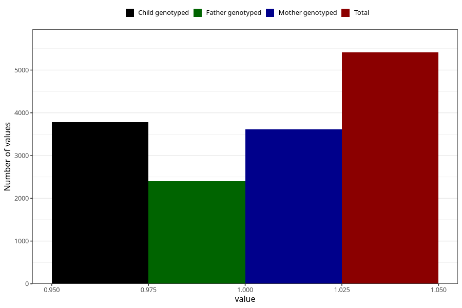

# contraception_used_iud
Variable mapping to questionnaire: q1m, question AA30.
- Number of values:

| Value | Total | Child genotyped | Mother genotyped | Father genotyped |
| ----- | ----- | --------------- | ---------------- | ---------------- |
| Missing | 108211 | 71647 | 68151 | 47818 |
| Non-missing | 5412 | 3784 | 3618 | 2400 |
| 1 | 5412 | 3784 | 3618 | 2400 |

