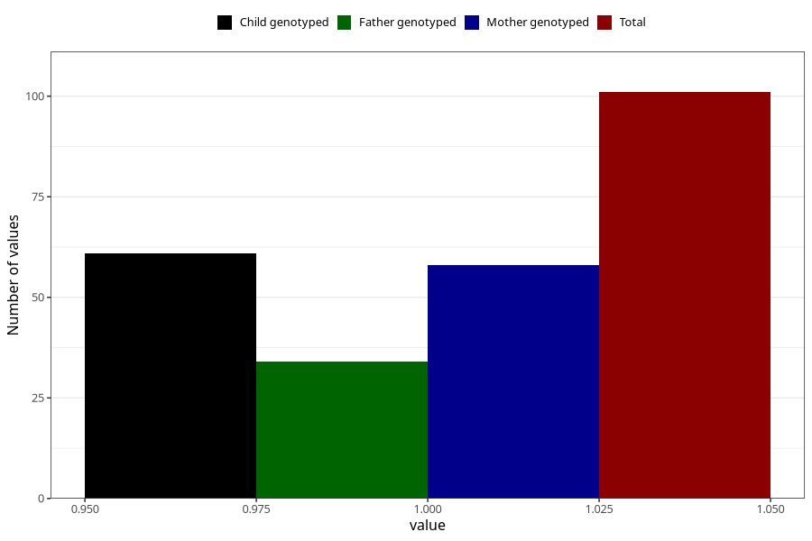

# contraception_used_spermicies
Variable mapping to questionnaire: q1m, question AA35.
- Number of values:

| Value | Total | Child genotyped | Mother genotyped | Father genotyped |
| ----- | ----- | --------------- | ---------------- | ---------------- |
| Missing | 113522 | 75370 | 71711 | 50184 |
| Non-missing | 101 | 61 | 58 | 34 |
| 1 | 101 | 61 | 58 | 34 |

