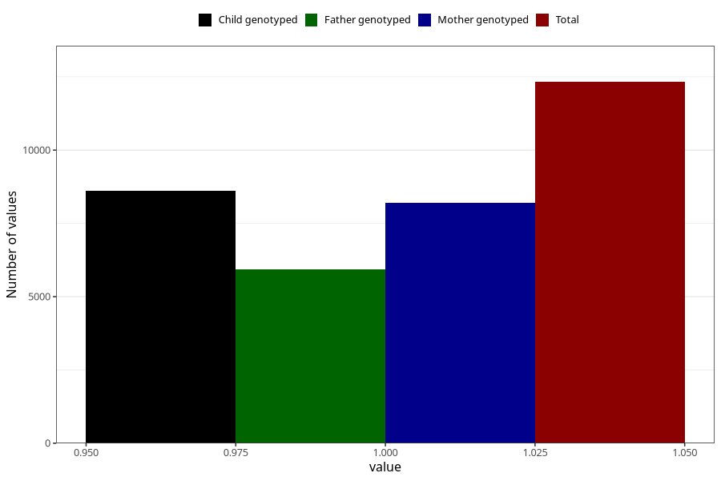

# lost_periods_previous_pregnancy
Variable mapping to questionnaire: q1m, question AA18.
- Number of values:

| Value | Total | Child genotyped | Mother genotyped | Father genotyped |
| ----- | ----- | --------------- | ---------------- | ---------------- |
| Missing | 101297 | 66809 | 63574 | 44275 |
| Non-missing | 12326 | 8622 | 8195 | 5943 |
| 1 | 12326 | 8622 | 8195 | 5943 |

