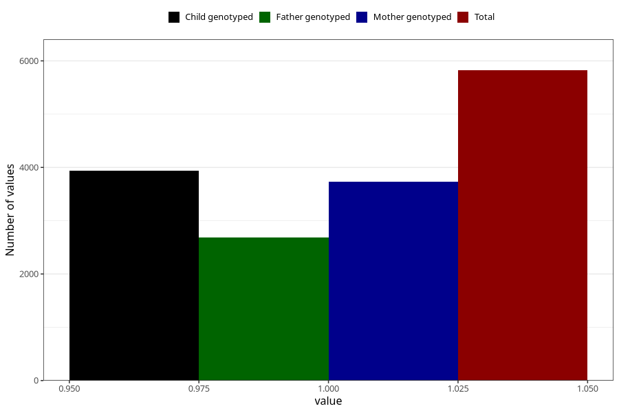

# lost_periods_yes_other
Variable mapping to questionnaire: q1m, question AA19.
- Number of values:

| Value | Total | Child genotyped | Mother genotyped | Father genotyped |
| ----- | ----- | --------------- | ---------------- | ---------------- |
| Missing | 107801 | 71489 | 68034 | 47537 |
| Non-missing | 5822 | 3942 | 3735 | 2681 |
| 1 | 5822 | 3942 | 3735 | 2681 |

