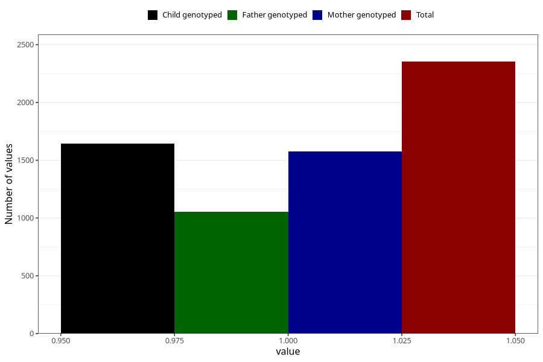

# treated_for_infertility_previous_hormone_treatment
Variable mapping to questionnaire: q1m, question AA74.
- Number of values:

| Value | Total | Child genotyped | Mother genotyped | Father genotyped |
| ----- | ----- | --------------- | ---------------- | ---------------- |
| Missing | 111270 | 73786 | 70193 | 49163 |
| Non-missing | 2353 | 1645 | 1576 | 1055 |
| 1 | 2353 | 1645 | 1576 | 1055 |

