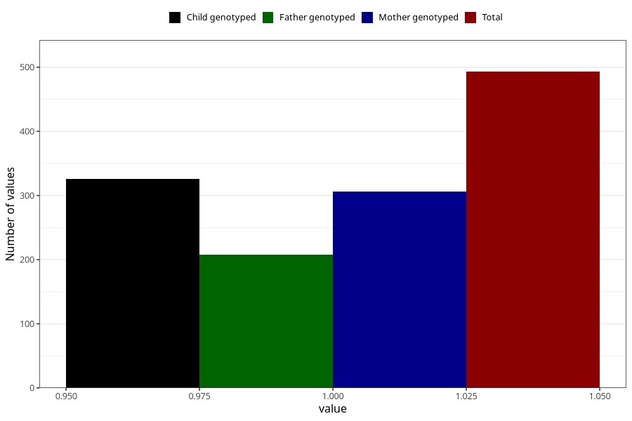

# treated_for_infertility_previous_other_surgery
Variable mapping to questionnaire: q1m, question AA70.
- Number of values:

| Value | Total | Child genotyped | Mother genotyped | Father genotyped |
| ----- | ----- | --------------- | ---------------- | ---------------- |
| Missing | 113130 | 75105 | 71463 | 50010 |
| Non-missing | 493 | 326 | 306 | 208 |
| 1 | 493 | 326 | 306 | 208 |

