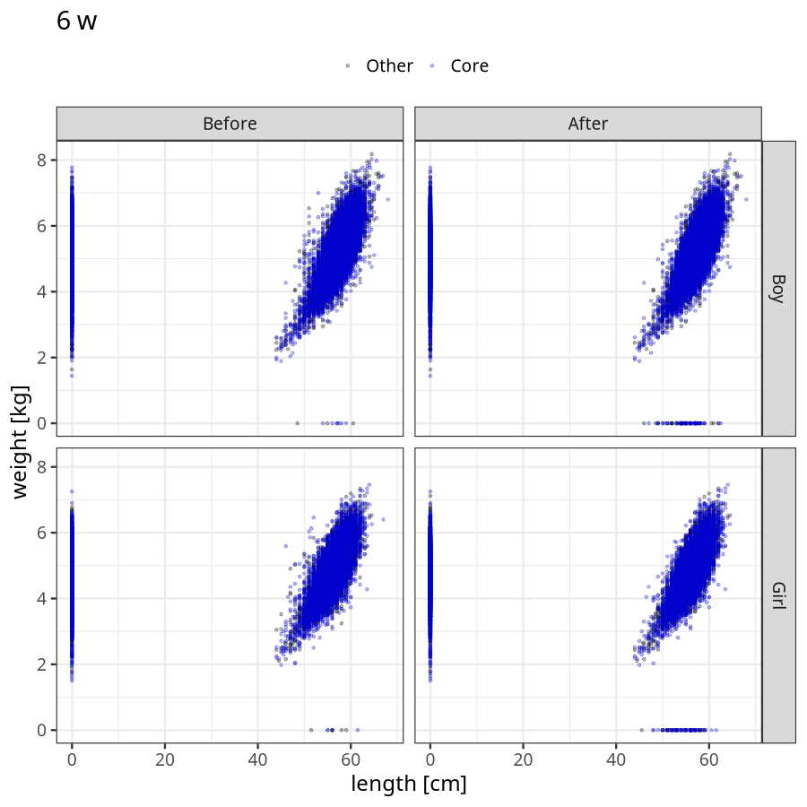
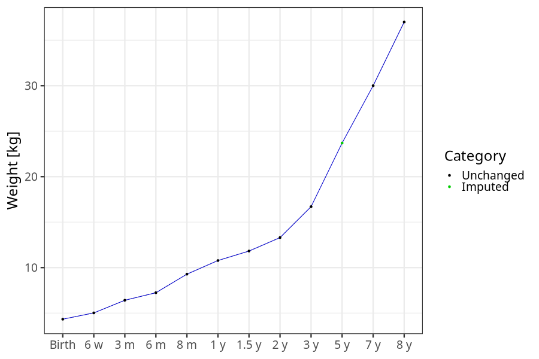
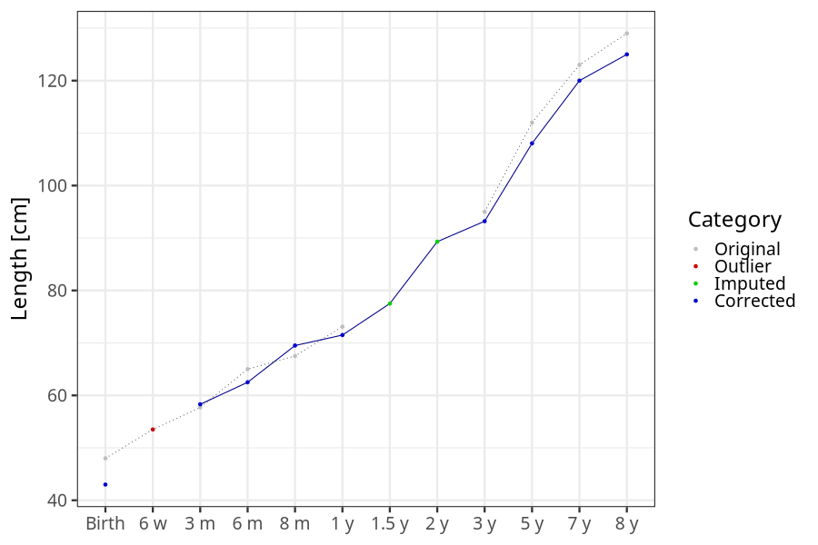
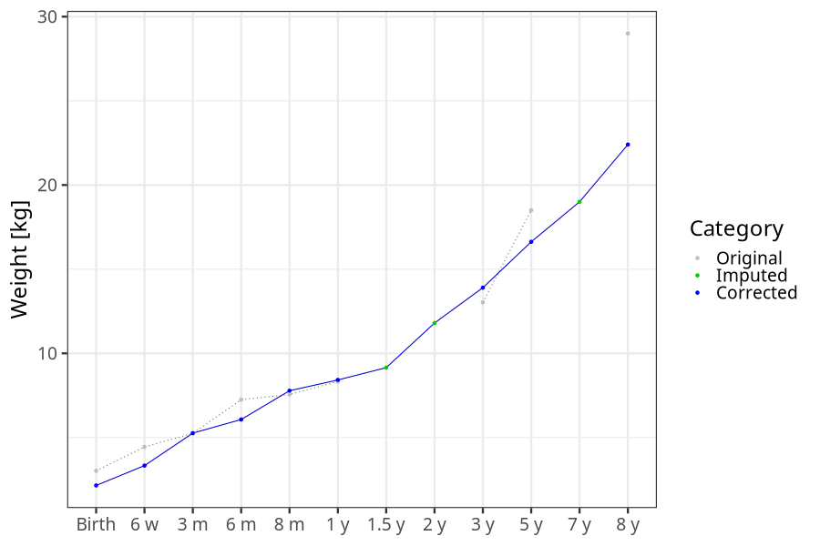
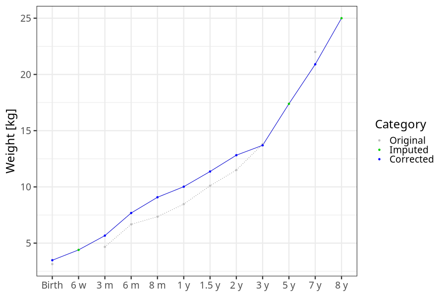
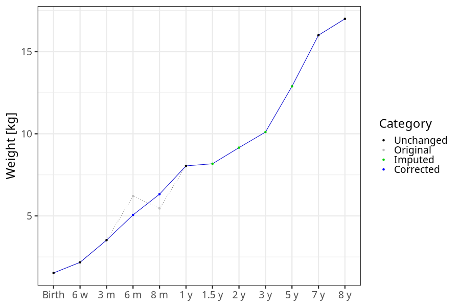
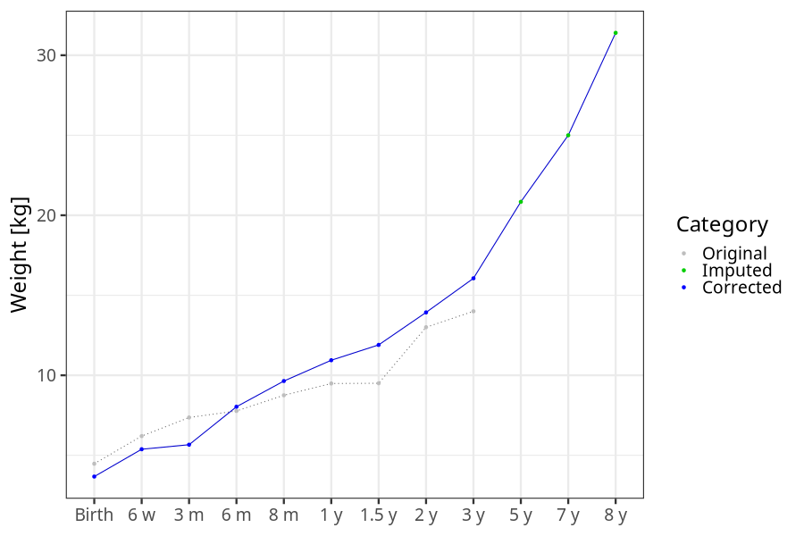

# Phenotypes
### Number of values

### Length vs weight

### Imputation
- Children with no data point altered: 43115
- Children with at least one data point altered: 32358
#### Random example: 4539
> outlier@length_2y imputed@length_2y

#### Random example: 29173
> outlier@length_2y imputed@length_2y

#### Random example: 53995
> outlier@length_2y imputed@length_2y

#### Random example: 58028
> outlier@length_2y imputed@length_2y

#### Random example: 1846
> outlier@length_2y imputed@length_2y

#### Random example: 46028
> outlier@length_2y imputed@length_2y

#### Random example: 43536
> outlier@length_2y imputed@length_2y

#### Random example: 3324
> outlier@length_2y imputed@length_2y

#### Random example: 20317
> outlier@length_2y imputed@length_2y

#### Random example: 39523
> outlier@length_2y imputed@length_2y

#### Random example: 49888
> outlier@length_2y imputed@length_2y

#### Random example: 71754
> outlier@length_2y imputed@length_2y

#### Random example: 21615
> outlier@length_2y imputed@length_2y

#### Random example: 16000
> outlier@length_2y imputed@length_2y

#### Random example: 50491
> outlier@length_2y imputed@length_2y

#### Random example: 46985
> outlier@length_2y imputed@length_2y

#### Random example: 13520
> outlier@length_2y imputed@length_2y

#### Random example: 62078
> outlier@length_2y imputed@length_2y

#### Random example: 30523
> outlier@length_2y imputed@length_2y

#### Random example: 9715
> outlier@length_2y imputed@length_2y

#### Most extreme example (1): 49659
> 

#### Most extreme example (2): 22991
> imputed@length_16m imputed@length_2y imputed@weight_16m imputed@weight_2y

#### Most extreme example (3): 63617
> 

#### Most extreme example (4): 29149
> imputed@length_8m imputed@length_1y imputed@length_16m imputed@weight_8m imputed@weight_1y imputed@weight_16m

#### Most extreme example (5): 48578
> outlier@length_2y imputed@length_2y

#### Most extreme example (6): 72984
> 

#### Most extreme example (7): 20923
> imputed@weight_6m imputed@weight_8m imputed@weight_16m

#### Most extreme example (8): 24186
> imputed@length_16m imputed@length_2y imputed@weight_16m imputed@weight_2y

#### Most extreme example (9): 36066
> outlier@weight_1y imputed@weight_1y imputed@weight_2y

#### Most extreme example (10): 50026
> 

#### Most extreme example (11): 6080
> imputed@length_16m imputed@length_2y imputed@weight_16m imputed@weight_2y

#### Most extreme example (12): 60550
> 

#### Most extreme example (13): 46009
> imputed@length_8m imputed@length_1y imputed@length_16m imputed@length_2y imputed@length_5y

#### Most extreme example (14): 10515
> imputed@length_16m imputed@weight_16m imputed@weight_5y

#### Most extreme example (15): 51390
> imputed@length_16m imputed@length_2y imputed@length_3y imputed@weight_16m imputed@weight_2y imputed@weight_3y

#### Most extreme example (16): 32356
> 

#### Most extreme example (17): 19965
> 

#### Most extreme example (18): 74746
> imputed@length_16m imputed@length_2y imputed@length_5y imputed@weight_16m imputed@weight_2y imputed@weight_5y

#### Most extreme example (19): 48120
> 

#### Most extreme example (20): 53389
> imputed@length_3y imputed@length_5y imputed@weight_3y imputed@weight_5y outlier@length_8y

