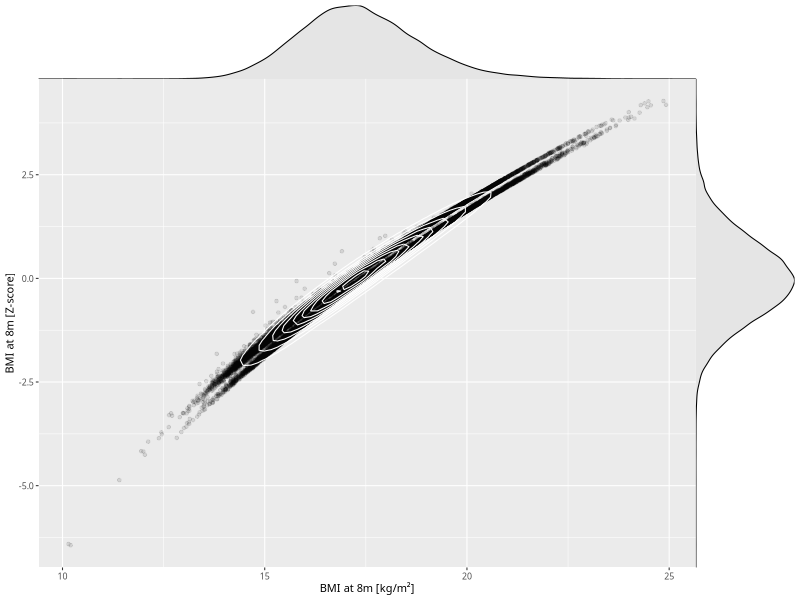

## BMI at 8m

| Name | # Children | # Mothers | # Fathers | # Total |
| ---- | ---------- | --------- | --------- | ------- |
| bmi_8m | 54520 | 51910 | 36932 | 143362 |
| z_bmi_8m | 54520 | 51910 | 36932 | 143362 |

- Formula: `bmi_8m ~ fp(pregnancy_duration_1)`
- Sigma formula: ` ~ pregnancy_duration_1`
- Distribution: `LOGNO`
- Normalization: `centiles.pred` Z-scores

