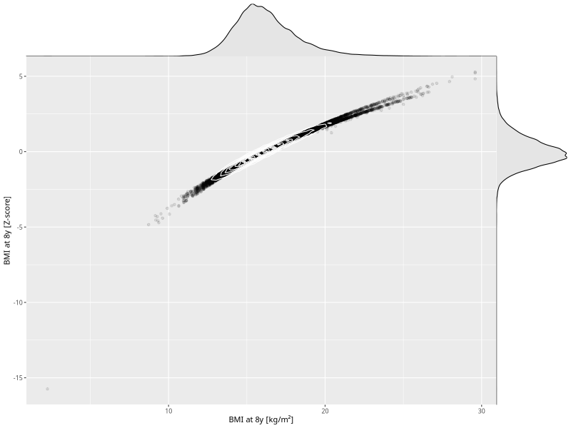

## BMI at 8y

| Name | # Children | # Mothers | # Fathers | # Total |
| ---- | ---------- | --------- | --------- | ------- |
| bmi_8y | 26441 | 25042 | 18747 | 70230 |
| z_bmi_8y | 26441 | 25042 | 18747 | 70230 |

- Formula: `bmi_8y ~ fp(pregnancy_duration_1)`
- Sigma formula: ` ~ pregnancy_duration_1`
- Distribution: `LOGNO`
- Normalization: `centiles.pred` Z-scores

