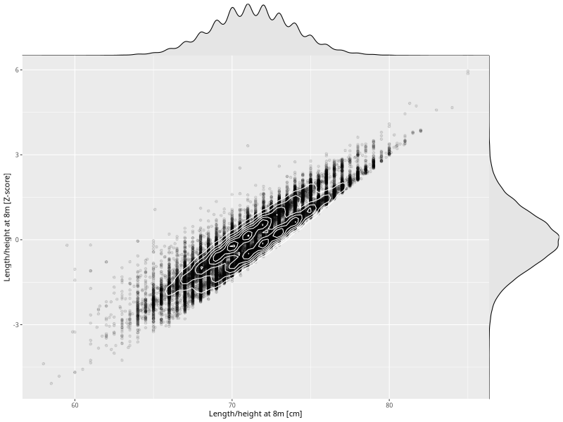

## Length/height at 8m

| Name | # Children | # Mothers | # Fathers | # Total |
| ---- | ---------- | --------- | --------- | ------- |
| length_8m | 54807 | 52181 | 37138 | 144126 |
| z_length_8m | 54807 | 52181 | 37138 | 144126 |

- Formula: `length_8m ~ fp(pregnancy_duration_1)`
- Sigma formula: ` ~ pregnancy_duration_1`
- Distribution: `NO`
- Normalization: `centiles.pred` Z-scores

