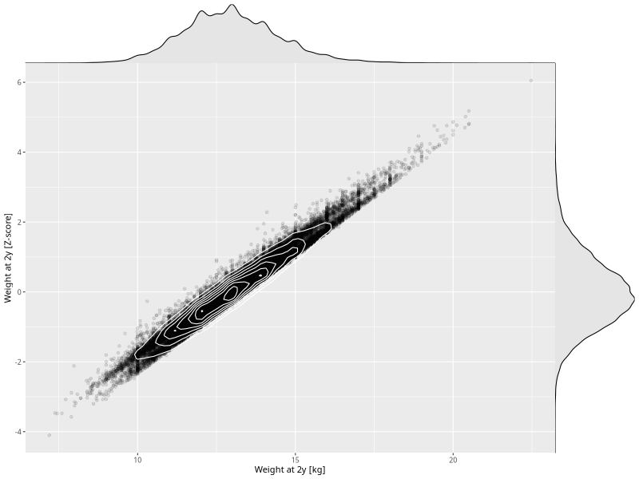

## Weight at 2y

| Name | # Children | # Mothers | # Fathers | # Total |
| ---- | ---------- | --------- | --------- | ------- |
| weight_2y | 41662 | 39581 | 29129 | 110372 |
| z_weight_2y | 41662 | 39581 | 29129 | 110372 |

- Formula: `weight_2y ~ fp(pregnancy_duration_1)`
- Sigma formula: ` ~ pregnancy_duration_1`
- Distribution: `NO`
- Normalization: `centiles.pred` Z-scores

