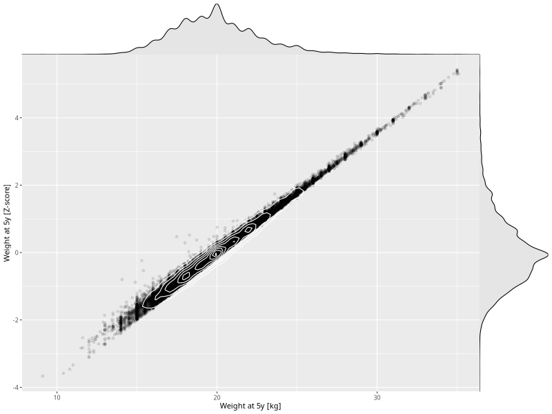

## Weight at 5y

| Name | # Children | # Mothers | # Fathers | # Total |
| ---- | ---------- | --------- | --------- | ------- |
| weight_5y | 34249 | 32469 | 24502 | 91220 |
| z_weight_5y | 34249 | 32469 | 24502 | 91220 |

- Formula: `weight_5y ~ fp(pregnancy_duration_1)`
- Sigma formula: ` ~ pregnancy_duration_1`
- Distribution: `NO`
- Normalization: `centiles.pred` Z-scores

