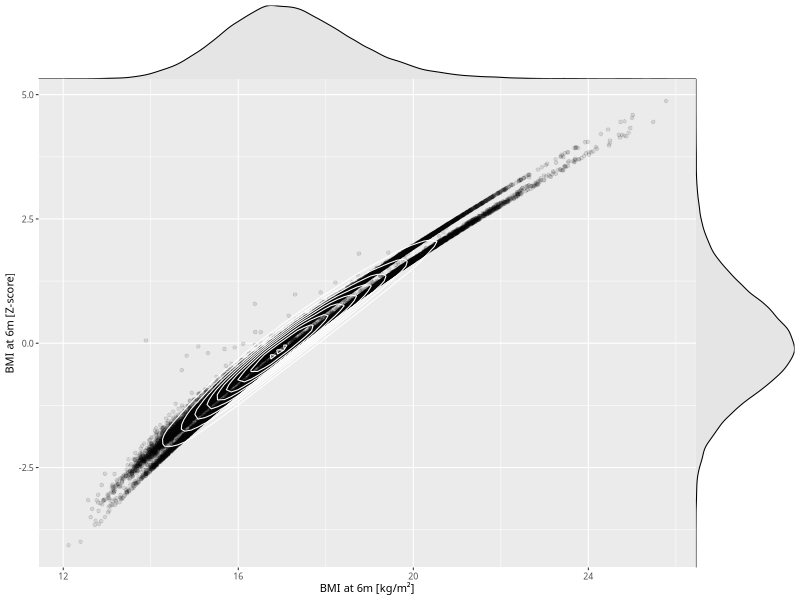

## BMI at 6m

| Name | # Children | # Mothers | # Fathers | # Total |
| ---- | ---------- | --------- | --------- | ------- |
| bmi_6m | 62315 | 59343 | 42000 | 163658 |
| z_bmi_6m | 62315 | 59343 | 42000 | 163658 |

- Formula: `bmi_6m ~ fp(pregnancy_duration_1)`
- Sigma formula: ` ~ pregnancy_duration_1`
- Distribution: `LOGNO`
- Normalization: `centiles.pred` Z-scores

