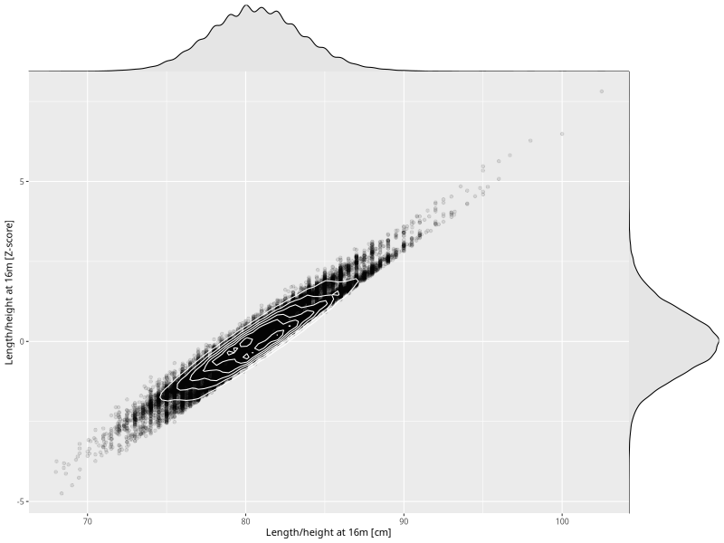

## Length/height at 16m

| Name | # Children | # Mothers | # Fathers | # Total |
| ---- | ---------- | --------- | --------- | ------- |
| length_16m | 41737 | 39663 | 29212 | 110612 |
| z_length_16m | 41737 | 39663 | 29212 | 110612 |

- Formula: `length_16m ~ fp(pregnancy_duration_1)`
- Sigma formula: ` ~ pregnancy_duration_1`
- Distribution: `NO`
- Normalization: `centiles.pred` Z-scores

