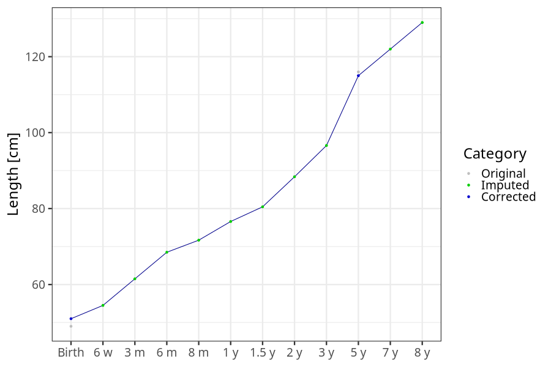
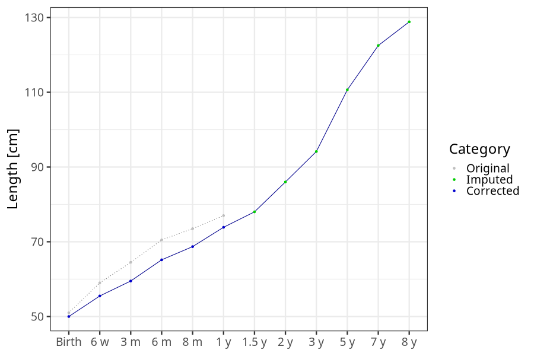
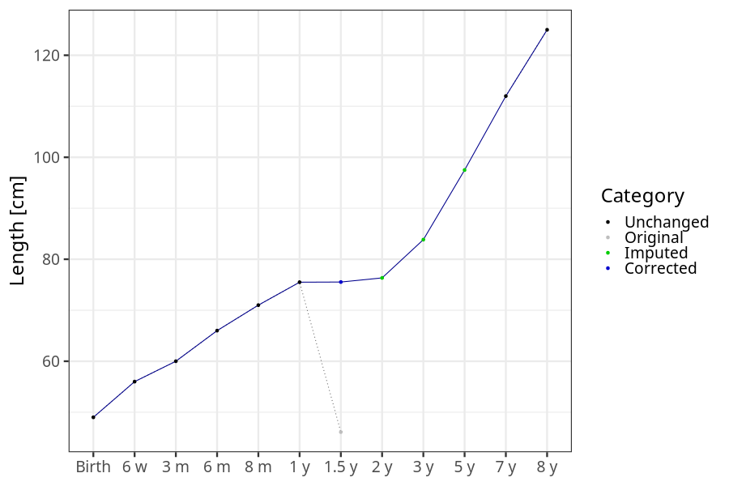
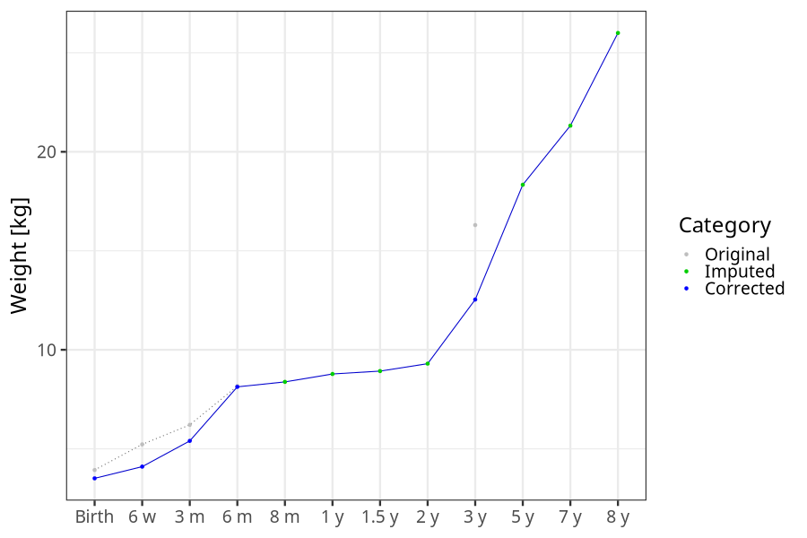
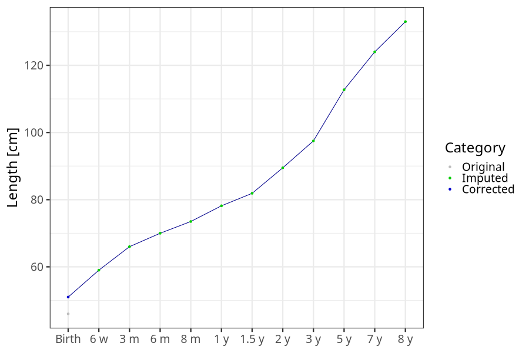
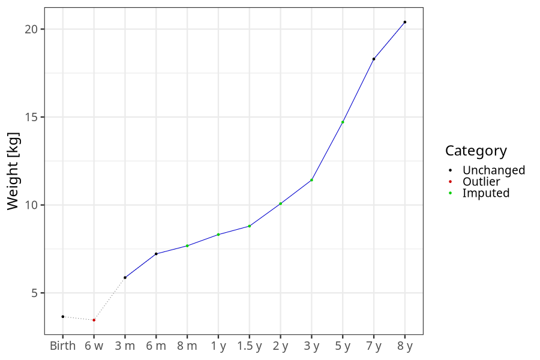

# Phenotypes
### Number of values

### Length vs weight

### Imputation
- Children with no data point altered: 43024
- Children with at least one data point altered: 32265
#### Random example: 31329
> outlier@length_2y imputed@length_2y

#### Random example: 15250
> outlier@length_2y imputed@length_2y

#### Random example: 10622
> outlier@length_2y imputed@length_2y

#### Random example: 13808
> outlier@length_2y imputed@length_2y

#### Random example: 63256
> outlier@length_2y imputed@length_2y

#### Random example: 56453
> outlier@length_2y imputed@length_2y

#### Random example: 14021
> outlier@length_2y imputed@length_2y

#### Random example: 45018
> outlier@length_2y imputed@length_2y

#### Random example: 25397
> outlier@length_2y imputed@length_2y

#### Random example: 38486
> outlier@length_2y imputed@length_2y

#### Random example: 51093
> outlier@length_2y imputed@length_2y

#### Random example: 38699
> outlier@length_2y imputed@length_2y

#### Random example: 55984
> outlier@length_2y imputed@length_2y

#### Random example: 36754
> outlier@length_2y imputed@length_2y

#### Random example: 65973
> outlier@length_2y imputed@length_2y

#### Random example: 18576
> outlier@length_2y imputed@length_2y

#### Random example: 12507
> outlier@length_2y imputed@length_2y

#### Random example: 16200
> outlier@length_2y imputed@length_2y

#### Random example: 60764
> outlier@length_2y imputed@length_2y

#### Random example: 59280
> outlier@length_2y imputed@length_2y

#### Most extreme example (1): 62880
> 

#### Most extreme example (2): 65713
> imputed@length_16m imputed@length_2y imputed@weight_16m imputed@weight_2y

#### Most extreme example (3): 31576
> 

#### Most extreme example (4): 21624
> imputed@length_8m imputed@length_1y imputed@length_16m imputed@weight_8m imputed@weight_1y imputed@weight_16m

#### Most extreme example (5): 14737
> outlier@length_2y imputed@length_2y

#### Most extreme example (6): 43900
> 

#### Most extreme example (7): 9395
> imputed@weight_6m imputed@weight_8m imputed@weight_16m

#### Most extreme example (8): 2071
> imputed@length_16m imputed@length_2y imputed@weight_16m imputed@weight_2y

#### Most extreme example (9): 49369
> outlier@weight_1y imputed@weight_1y imputed@weight_2y

#### Most extreme example (10): 21809
> 

#### Most extreme example (11): 67380
> imputed@length_16m imputed@length_2y imputed@weight_16m imputed@weight_2y

#### Most extreme example (12): 9936
> 

#### Most extreme example (13): 66733
> imputed@length_8m imputed@length_1y imputed@length_16m imputed@length_2y imputed@length_5y

#### Most extreme example (14): 23161
> imputed@length_16m imputed@weight_16m imputed@weight_5y

#### Most extreme example (15): 31835
> imputed@length_16m imputed@length_2y imputed@length_3y imputed@weight_16m imputed@weight_2y imputed@weight_3y

#### Most extreme example (16): 43391
> 

#### Most extreme example (17): 23677
> 

#### Most extreme example (18): 7325
> imputed@length_16m imputed@length_2y imputed@length_5y imputed@weight_16m imputed@weight_2y imputed@weight_5y outlier@weight_8y

#### Most extreme example (19): 18251
> 

#### Most extreme example (20): 41856
> imputed@length_3y imputed@length_5y imputed@weight_3y imputed@weight_5y outlier@length_8y

