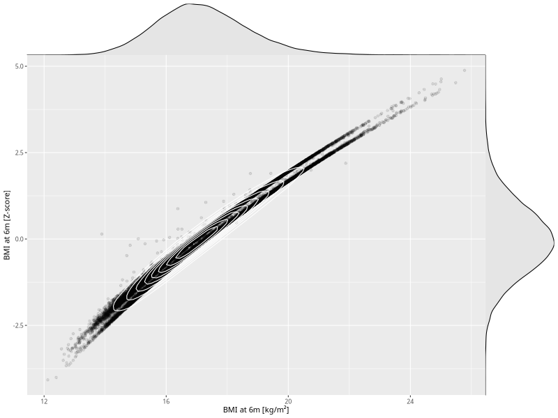

## BMI at 6m

| Name | # Children | # Mothers | # Fathers | # Total |
| ---- | ---------- | --------- | --------- | ------- |
| bmi_6m | 62170 | 59205 | 41856 | 163231 |
| z_bmi_6m | 62170 | 59205 | 41856 | 163231 |

- Formula: `bmi_6m ~ fp(pregnancy_duration_1)`
- Sigma formula: ` ~ pregnancy_duration_1`
- Distribution: `LOGNO`
- Normalization: `centiles.pred` Z-scores

