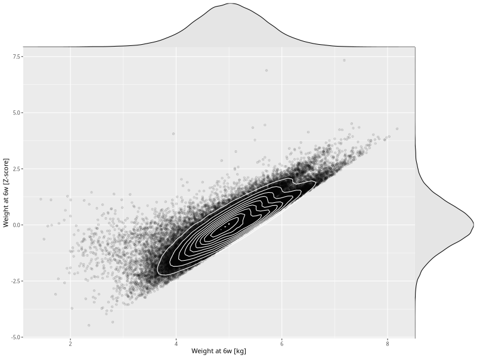

## Weight at 6w

| Name | # Children | # Mothers | # Fathers | # Total |
| ---- | ---------- | --------- | --------- | ------- |
| weight_6w | 55744 | 52946 | 39383 | 148073 |
| z_weight_6w | 55744 | 52946 | 39383 | 148073 |

- Formula: `weight_6w ~ fp(pregnancy_duration_1)`
- Sigma formula: ` ~ pregnancy_duration_1`
- Distribution: `NO`
- Normalization: `centiles.pred` Z-scores

