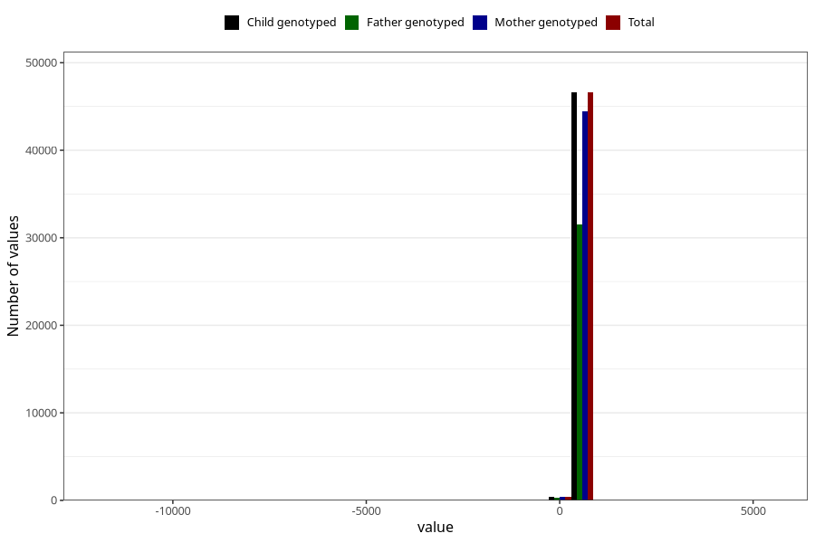

# age_15_18m_1
Variable mapping to `Q5_AGE_15_18_M` in `Skjema5_18mnd_v12`.
- Number of values:

| Value | Total | Child genotyped | Mother genotyped | Father genotyped |
| ----- | ----- | --------------- | ---------------- | ---------------- |
| Missing | 28286 | 28286 | 26843 | 18226 |
| Non-missing | 47022 | 47022 | 44807 | 31858 |
| 25th percentile | 461 | 461 | 461 | 460 |
| 50th percentile | 474 | 474 | 474 | 473 |
| 75th percentile | 511 | 511 | 512 | 510 |
| Mean | 484.964612309132 | 484.964612309132 | 485.182337581182 | 484.591060330215 |
| Standard deviation | 110.968701741086 | 110.968701741086 | 104.152606710428 | 85.0438304506409 |
| N | 47022 | 47022 | 44807 | 31858 |

