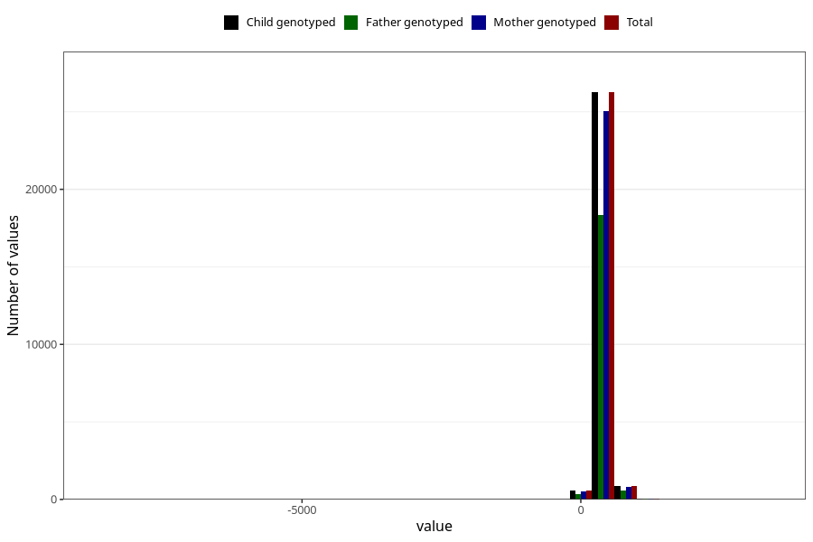

# age_15_18m_2
Variable mapping to `Q6_AGE_18_M` in `Skjema6_3aar_v12`.
- Number of values:

| Value | Total | Child genotyped | Mother genotyped | Father genotyped |
| ----- | ----- | --------------- | ---------------- | ---------------- |
| Missing | 47551 | 47551 | 45195 | 30707 |
| Non-missing | 27757 | 27757 | 26455 | 19377 |
| 25th percentile | 459 | 459 | 459 | 459 |
| 50th percentile | 474 | 474 | 474 | 473 |
| 75th percentile | 527 | 527 | 527 | 523 |
| Mean | 488.31300212559 | 488.31300212559 | 488.192175392175 | 487.374722609279 |
| Standard deviation | 112.969018258259 | 112.969018258259 | 113.852189469997 | 117.947114363607 |
| N | 27757 | 27757 | 26455 | 19377 |

