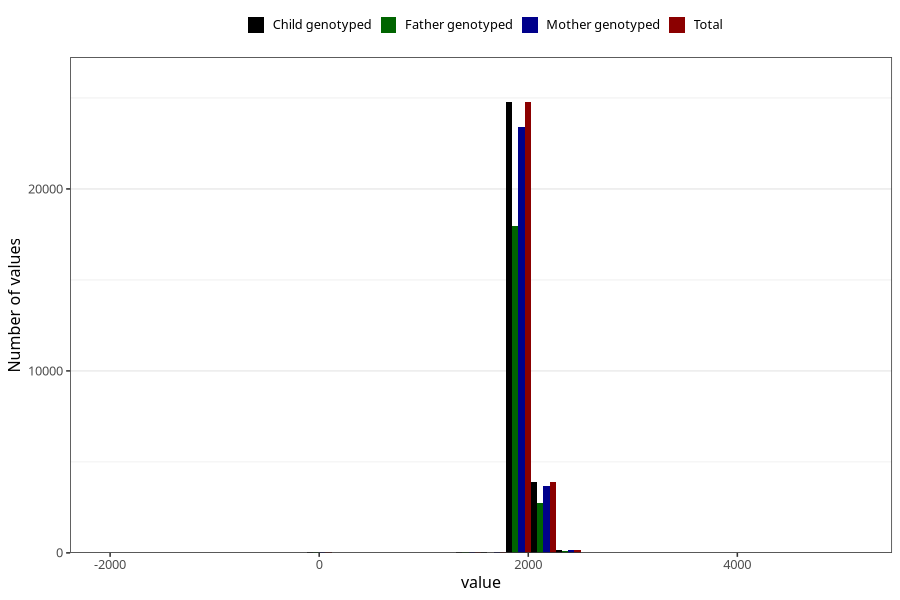

# age_5y
Variable mapping to `AGE_MTHS_Q5AAR` in `Skjema5aar_v12`.
- Number of values:

| Value | Total | Child genotyped | Mother genotyped | Father genotyped |
| ----- | ----- | --------------- | ---------------- | ---------------- |
| Missing | 46308 | 46308 | 44187 | 29104 |
| Non-missing | 29000 | 29000 | 27463 | 20980 |
| 25th percentile | 1826.25 | 1826.25 | 1826.25 | 1826.25 |
| 50th percentile | 1856.6875 | 1856.6875 | 1856.6875 | 1856.6875 |
| 75th percentile | 1948 | 1948 | 1948 | 1917.5625 |
| Mean | 1899.40810560345 | 1899.40810560345 | 1899.68990323344 | 1898.37439823642 |
| Standard deviation | 155.840291979834 | 155.840291979834 | 155.776897951218 | 157.892018348911 |
| N | 29000 | 29000 | 27463 | 20980 |

