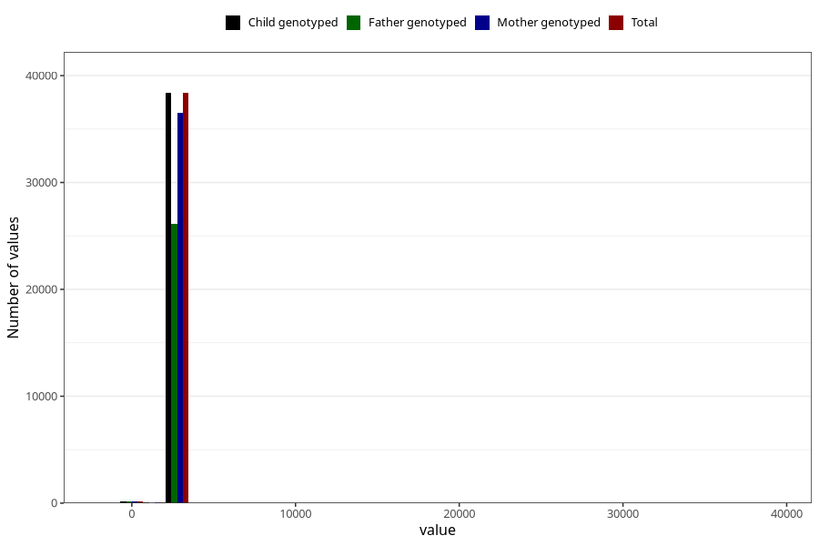

# age_7y
Variable mapping to `AGE_MTHS_Q7` in `Skjema7aar_v12`.
- Number of values:

| Value | Total | Child genotyped | Mother genotyped | Father genotyped |
| ----- | ----- | --------------- | ---------------- | ---------------- |
| Missing | 36694 | 36694 | 34946 | 23829 |
| Non-missing | 38614 | 38614 | 36704 | 26255 |
| 25th percentile | 2556.75 | 2556.75 | 2556.75 | 2556.75 |
| 50th percentile | 2587.1875 | 2587.1875 | 2587.1875 | 2587.1875 |
| 75th percentile | 2617.625 | 2617.625 | 2617.625 | 2617.625 |
| Mean | 2592.31743344383 | 2592.31743344383 | 2592.55867718777 | 2587.7393282232 |
| Standard deviation | 278.491849905503 | 278.491849905503 | 282.512737144335 | 301.916259597663 |
| N | 38614 | 38614 | 36704 | 26255 |

