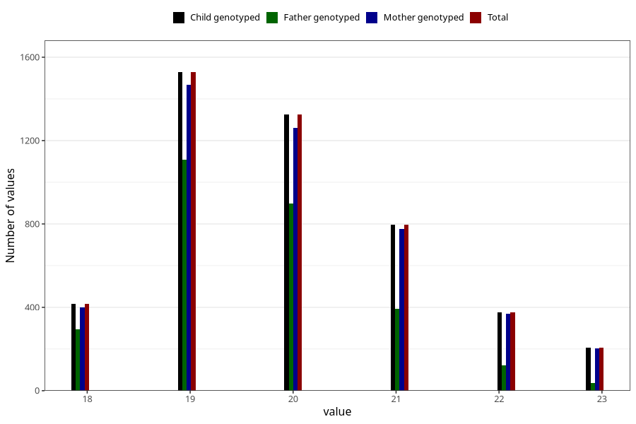

# age_answering_q_19
Variable mapping to `AGE_YRS_VG` in `19_aarsskjema_standard`.
- Number of values:

| Value | Total | Child genotyped | Mother genotyped | Father genotyped |
| ----- | ----- | --------------- | ---------------- | ---------------- |
| Missing | 70658 | 70658 | 67170 | 47234 |
| Non-missing | 4650 | 4650 | 4480 | 2850 |
| 18 | 418 | 418 | 400 | 295 |
| 19 | 1528 | 1528 | 1469 | 1107 |
| 20 | 1325 | 1325 | 1261 | 897 |
| 21 | 796 | 796 | 777 | 392 |
| 22 | 376 | 376 | 370 | 121 |
| 23 | 207 | 207 | 203 | 38 |

