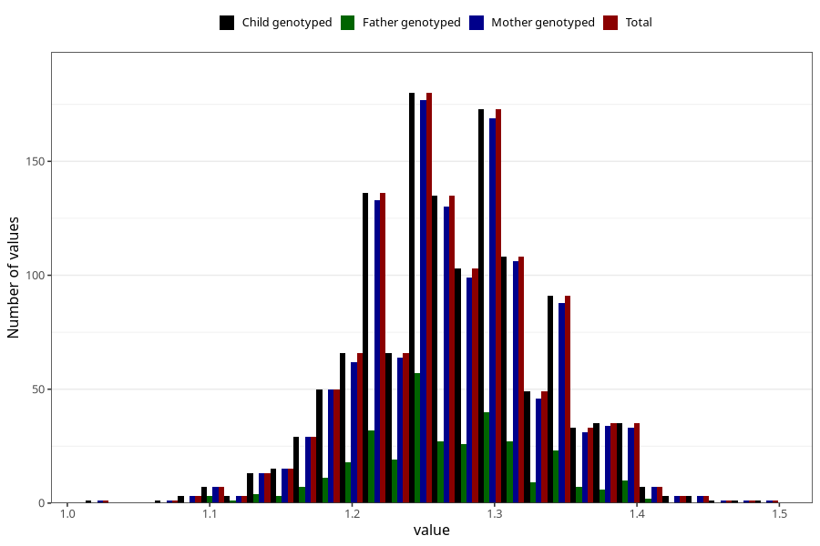

# height_7y_m
Variable mapping to `JJ324` in `Skjema7aar_v12`.
- Number of values:

| Value | Total | Child genotyped | Mother genotyped | Father genotyped |
| ----- | ----- | --------------- | ---------------- | ---------------- |
| Missing | 73960 | 73960 | 70340 | 49752 |
| Non-missing | 1348 | 1348 | 1310 | 332 |
| 25th percentile | 1.23 | 1.23 | 1.23 | 1.23 |
| 50th percentile | 1.27 | 1.27 | 1.27 | 1.26 |
| 75th percentile | 1.31 | 1.31 | 1.31 | 1.31 |
| Mean | 1.27068991097923 | 1.27068991097923 | 1.27028244274809 | 1.26734939759036 |
| Standard deviation | 0.0624033529379514 | 0.0624033529379514 | 0.0625165860112015 | 0.059986591399014 |
| N | 1348 | 1348 | 1310 | 332 |

