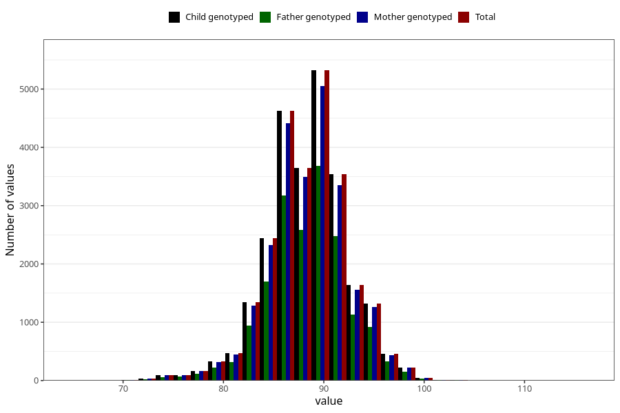

# length_2y
Variable mapping to `GG20` in `Skjema6_3aar_v12`.
- Number of values:

| Value | Total | Child genotyped | Mother genotyped | Father genotyped |
| ----- | ----- | --------------- | ---------------- | ---------------- |
| Missing | 49478 | 49478 | 47036 | 32127 |
| Non-missing | 25830 | 25830 | 24614 | 17957 |
| 25th percentile | 86 | 86 | 86 | 86 |
| 50th percentile | 88.5 | 88.5 | 88.5 | 88.5 |
| 75th percentile | 91 | 91 | 91 | 91 |
| Mean | 88.4308052651955 | 88.4308052651955 | 88.4219468595109 | 88.4523918249151 |
| Standard deviation | 3.97527735943292 | 3.97527735943292 | 3.98190848535409 | 3.96166913443811 |
| N | 25830 | 25830 | 24614 | 17957 |

