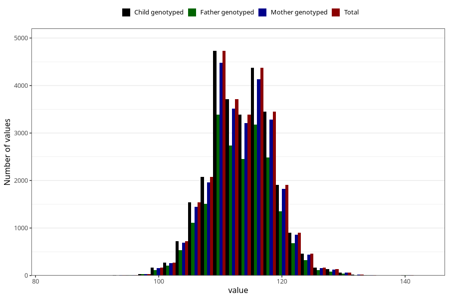

# length_5y
Variable mapping to `LL12` in `Skjema5aar_v12`.
- Number of values:

| Value | Total | Child genotyped | Mother genotyped | Father genotyped |
| ----- | ----- | --------------- | ---------------- | ---------------- |
| Missing | 47158 | 47158 | 44971 | 29696 |
| Non-missing | 28150 | 28150 | 26679 | 20388 |
| 25th percentile | 110 | 110 | 110 | 110 |
| 50th percentile | 113 | 113 | 113 | 113 |
| 75th percentile | 117 | 117 | 117 | 117 |
| Mean | 113.22809946714 | 113.22809946714 | 113.239026950036 | 113.206199725329 |
| Standard deviation | 5.32785421418443 | 5.32785421418443 | 5.33879794693905 | 5.31422558720796 |
| N | 28150 | 28150 | 26679 | 20388 |

