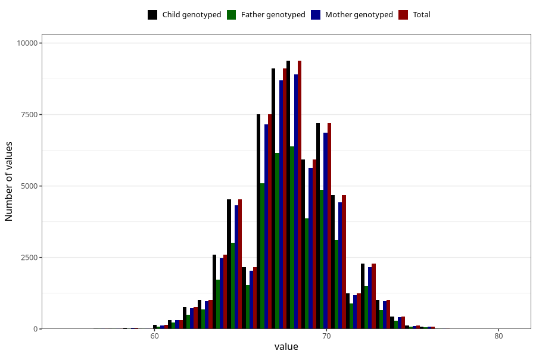

# length_6m
Variable mapping to `DD225` in `Skjema4_6mnd_v12`.
- Number of values:

| Value | Total | Child genotyped | Mother genotyped | Father genotyped |
| ----- | ----- | --------------- | ---------------- | ---------------- |
| Missing | 14686 | 14686 | 13930 | 9277 |
| Non-missing | 60622 | 60622 | 57720 | 40807 |
| 25th percentile | 66 | 66 | 66 | 66 |
| 50th percentile | 68 | 68 | 68 | 68 |
| 75th percentile | 69.5 | 69.5 | 69.5 | 69.5 |
| Mean | 67.8686483454851 | 67.8686483454851 | 67.8675814275814 | 67.8589727252677 |
| Standard deviation | 2.55423987800788 | 2.55423987800788 | 2.55359339169176 | 2.54510057447483 |
| N | 60622 | 60622 | 57720 | 40807 |

