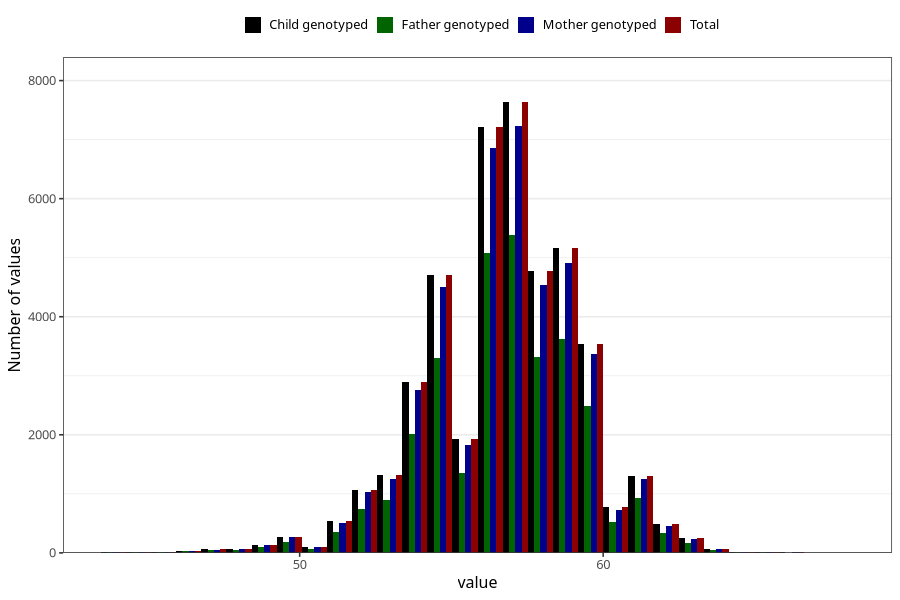

# length_6w
Variable mapping to `DD213` in `Skjema4_6mnd_v12`.
- Number of values:

| Value | Total | Child genotyped | Mother genotyped | Father genotyped |
| ----- | ----- | --------------- | ---------------- | ---------------- |
| Missing | 30870 | 30870 | 29404 | 19004 |
| Non-missing | 44438 | 44438 | 42246 | 31080 |
| 25th percentile | 55 | 55 | 55 | 55 |
| 50th percentile | 57 | 57 | 57 | 57 |
| 75th percentile | 58.5 | 58.5 | 58.5 | 58.5 |
| Mean | 56.7890094063639 | 56.7890094063639 | 56.7853382568764 | 56.798416988417 |
| Standard deviation | 2.51127722789557 | 2.51127722789557 | 2.51102583893317 | 2.50123726335761 |
| N | 44438 | 44438 | 42246 | 31080 |

