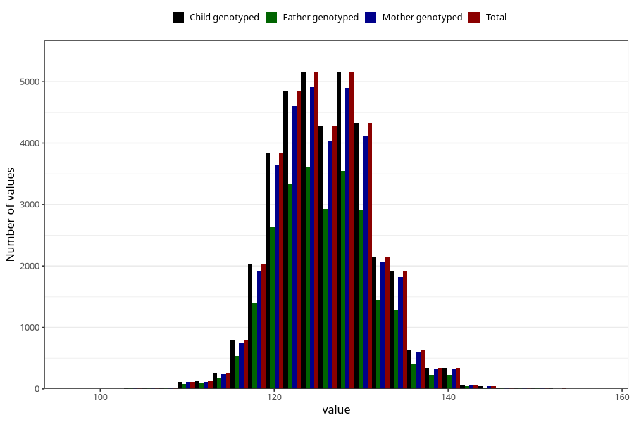

# length_7y
Variable created during phenotype curation.
- Number of values:

| Value | Total | Child genotyped | Mother genotyped | Father genotyped |
| ----- | ----- | --------------- | ---------------- | ---------------- |
| Missing | 38811 | 38811 | 36964 | 25127 |
| Non-missing | 36497 | 36497 | 34686 | 24957 |
| 25th percentile | 122 | 122 | 122 | 122 |
| 50th percentile | 126 | 126 | 126 | 126 |
| 75th percentile | 130 | 130 | 130 | 130 |
| Mean | 126.084828890046 | 126.084828890046 | 126.090238136424 | 126.024802660576 |
| Standard deviation | 5.50662032746522 | 5.50662032746522 | 5.51174602376101 | 5.47245959682047 |
| N | 36497 | 36497 | 34686 | 24957 |

