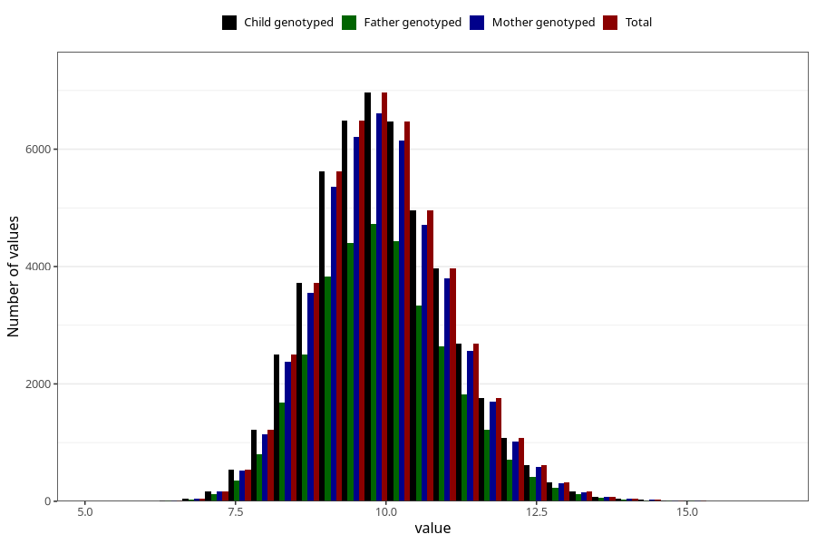

# weight_1y
Variable mapping to `EE392` in `Skjema5_18mnd_v12`.
- Number of values:

| Value | Total | Child genotyped | Mother genotyped | Father genotyped |
| ----- | ----- | --------------- | ---------------- | ---------------- |
| Missing | 25802 | 25802 | 24489 | 16628 |
| Non-missing | 49506 | 49506 | 47161 | 33456 |
| 25th percentile | 9.175 | 9.175 | 9.175 | 9.18 |
| 50th percentile | 9.9 | 9.9 | 9.9 | 9.9 |
| 75th percentile | 10.65 | 10.65 | 10.658 | 10.65 |
| Mean | 9.94919872338706 | 9.94919872338706 | 9.94946773817349 | 9.95122175394548 |
| Standard deviation | 1.11759754753395 | 1.11759754753395 | 1.11857577178936 | 1.11458730812266 |
| N | 49506 | 49506 | 47161 | 33456 |

