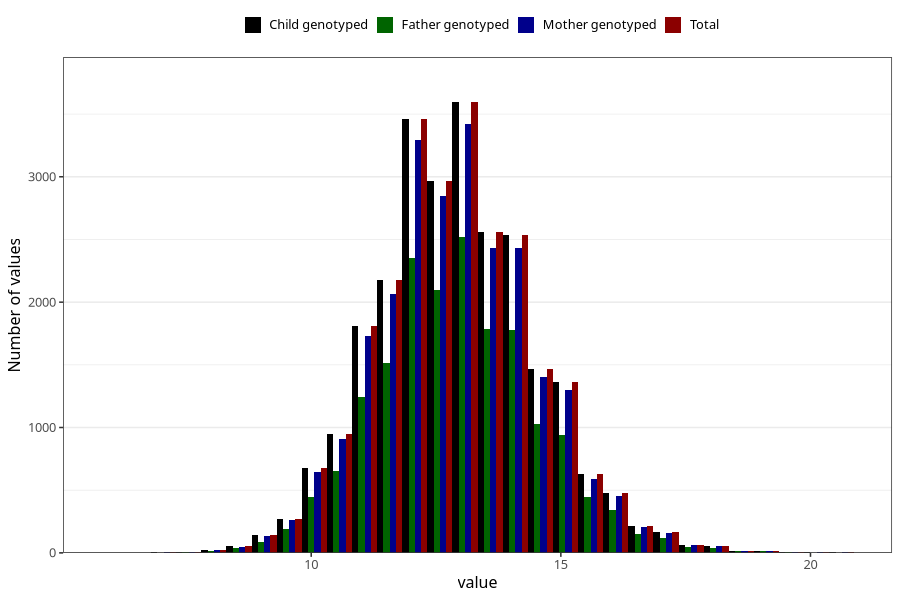

# weight_2y
Variable mapping to `GG21` in `Skjema6_3aar_v12`.
- Number of values:

| Value | Total | Child genotyped | Mother genotyped | Father genotyped |
| ----- | ----- | --------------- | ---------------- | ---------------- |
| Missing | 49590 | 49590 | 47131 | 32209 |
| Non-missing | 25718 | 25718 | 24519 | 17875 |
| 25th percentile | 11.9 | 11.9 | 11.9 | 11.97 |
| 50th percentile | 12.9 | 12.9 | 12.9 | 12.94 |
| 75th percentile | 14 | 14 | 14 | 14 |
| Mean | 12.9067559685823 | 12.9067559685823 | 12.905093193034 | 12.923688951049 |
| Standard deviation | 1.58570784095416 | 1.58570784095416 | 1.58653739699599 | 1.58435185965185 |
| N | 25718 | 25718 | 24519 | 17875 |

