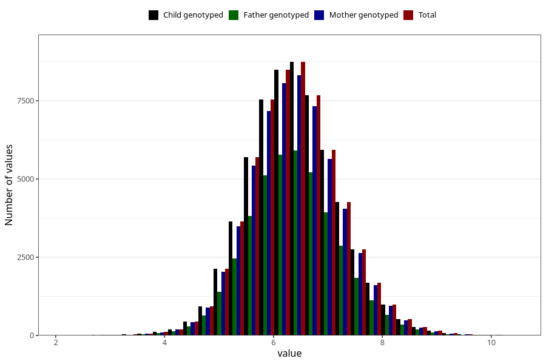

# weight_3m
Variable mapping to `DD218` in `Skjema4_6mnd_v12`.
- Number of values:

| Value | Total | Child genotyped | Mother genotyped | Father genotyped |
| ----- | ----- | --------------- | ---------------- | ---------------- |
| Missing | 12916 | 12916 | 12225 | 8083 |
| Non-missing | 62392 | 62392 | 59425 | 42001 |
| 25th percentile | 5.83 | 5.83 | 5.83 | 5.83 |
| 50th percentile | 6.35 | 6.35 | 6.35 | 6.35 |
| 75th percentile | 6.9 | 6.9 | 6.9 | 6.9 |
| Mean | 6.38096392165662 | 6.38096392165662 | 6.38012213714766 | 6.38027682674222 |
| Standard deviation | 0.826796222876243 | 0.826796222876243 | 0.826473697917624 | 0.822806086516129 |
| N | 62392 | 62392 | 59425 | 42001 |

