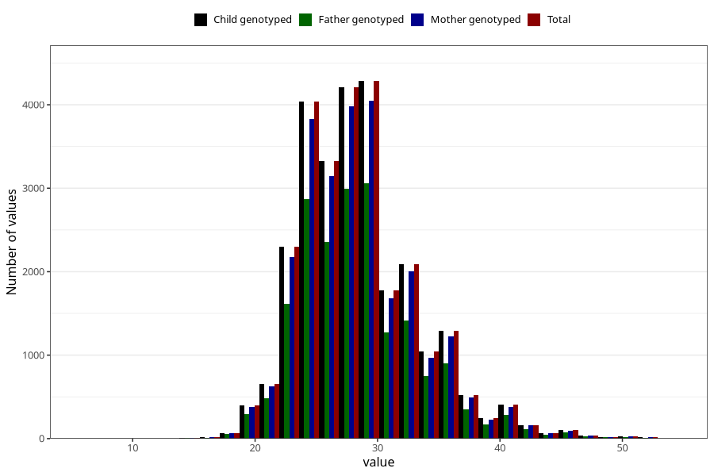

# weight_8y
Variable mapping to `NN25` in `Skjema8aar_v12`.
- Number of values:

| Value | Total | Child genotyped | Mother genotyped | Father genotyped |
| ----- | ----- | --------------- | ---------------- | ---------------- |
| Missing | 48204 | 48204 | 45979 | 30905 |
| Non-missing | 27104 | 27104 | 25671 | 19179 |
| 25th percentile | 25 | 25 | 25 | 25 |
| 50th percentile | 28 | 28 | 28 | 28 |
| 75th percentile | 31 | 31 | 31 | 31 |
| Mean | 28.5030401416765 | 28.5030401416765 | 28.5047056990378 | 28.4676573335419 |
| Standard deviation | 4.82172115810088 | 4.82172115810088 | 4.82921036529789 | 4.8090279484907 |
| N | 27104 | 27104 | 25671 | 19179 |

