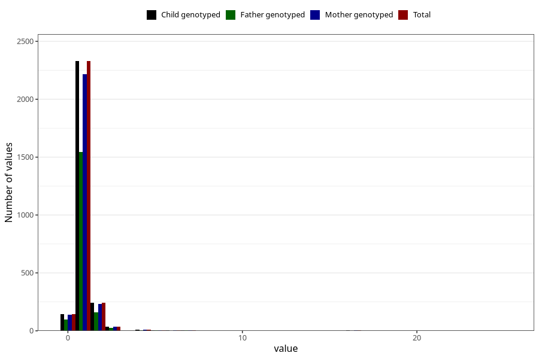

# accident_injury_number_12_18m
Variable mapping to `EE268` in `Skjema5_18mnd_v12`.
- Number of values:

| Value | Total | Child genotyped | Mother genotyped | Father genotyped |
| ----- | ----- | --------------- | ---------------- | ---------------- |
| Missing | 72530 | 72530 | 68998 | 48240 |
| Non-missing | 2778 | 2778 | 2652 | 1844 |
| 0 | 144 | 144 | 138 | 98 |
| 1 | 2329 | 2329 | 2218 | 1546 |
| 2 | 242 | 242 | 233 | 158 |
| 3 | 36 | 36 | 36 | 24 |
| 4 | 9 | 9 | 9 | 7 |
| 5 | 5 | 5 | 5 | 3 |
| 6 | 2 | 2 | 2 | 0 |
| 7 | 3 | 3 | 3 | 2 |
| 8 | 1 | 1 | 1 | 0 |
| 14 | 1 | 1 | 1 | 1 |
| 15 | 1 | 1 | 1 | 1 |
| 16 | 2 | 2 | 2 | 1 |
| 17 | 1 | 1 | 1 | 1 |
| 20 | 1 | 1 | 1 | 1 |
| 25 | 1 | 1 | 1 | 1 |

