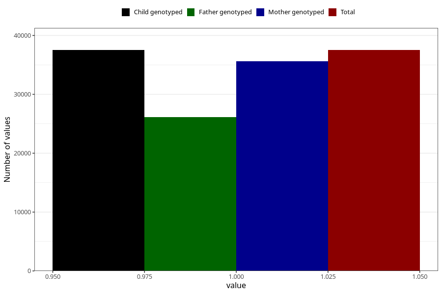

# asthma_no_3y
Variable mapping to `GG69` in `Skjema6_3aar_v12`.
- Number of values:

| Value | Total | Child genotyped | Mother genotyped | Father genotyped |
| ----- | ----- | --------------- | ---------------- | ---------------- |
| Missing | 37789 | 37789 | 36010 | 23989 |
| Non-missing | 37519 | 37519 | 35640 | 26095 |
| 1 | 37519 | 37519 | 35640 | 26095 |

