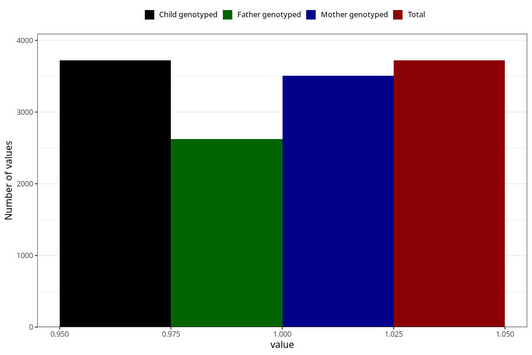

# atopic_previously_eczema_18m
Variable mapping to `EE829` in `Skjema5_18mnd_v12`.
- Number of values:

| Value | Total | Child genotyped | Mother genotyped | Father genotyped |
| ----- | ----- | --------------- | ---------------- | ---------------- |
| Missing | 71588 | 71588 | 68142 | 47459 |
| Non-missing | 3720 | 3720 | 3508 | 2625 |
| 1 | 3720 | 3720 | 3508 | 2625 |

