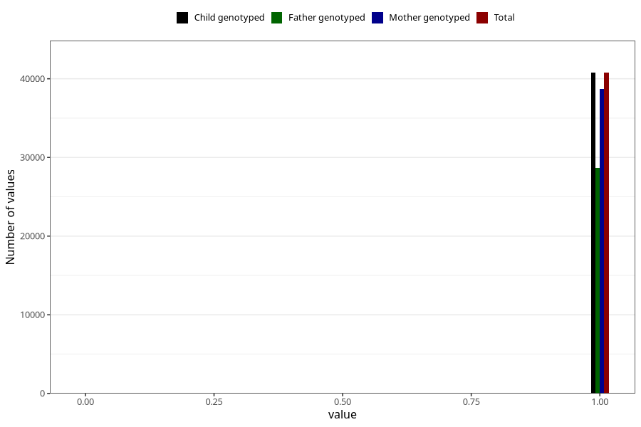

# autistic_traits_2_no_3y
Variable mapping to `GG582` in `Skjema6_3aar_v12`.
- Number of values:

| Value | Total | Child genotyped | Mother genotyped | Father genotyped |
| ----- | ----- | --------------- | ---------------- | ---------------- |
| Missing | 34524 | 34524 | 32920 | 21396 |
| Non-missing | 40784 | 40784 | 38730 | 28688 |
| 0 | 17 | 17 | 16 | 8 |
| 1 | 40767 | 40767 | 38714 | 28680 |

