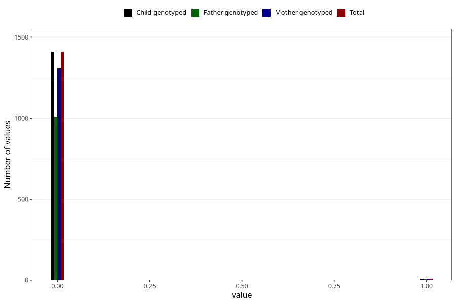

# autistic_traits_2_previous_3y
Variable mapping to `GG584` in `Skjema6_3aar_v12`.
- Number of values:

| Value | Total | Child genotyped | Mother genotyped | Father genotyped |
| ----- | ----- | --------------- | ---------------- | ---------------- |
| Missing | 73888 | 73888 | 70334 | 49068 |
| Non-missing | 1420 | 1420 | 1316 | 1016 |
| 0 | 1410 | 1410 | 1308 | 1010 |
| 1 | 10 | 10 | 8 | 6 |

