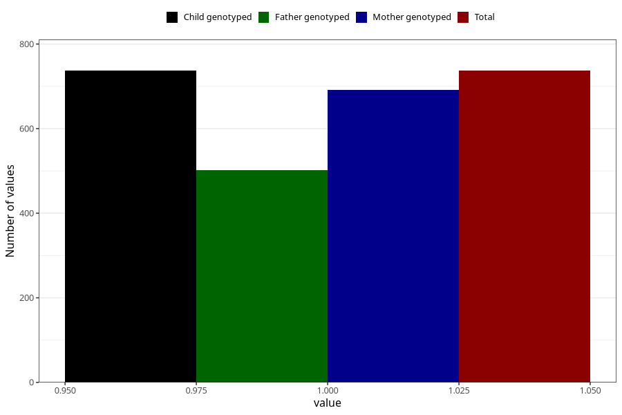

# behavioral_problems_difficult_and_unruly_past_8y
Variable mapping to `NN58` in `Skjema8aar_v12`.
- Number of values:

| Value | Total | Child genotyped | Mother genotyped | Father genotyped |
| ----- | ----- | --------------- | ---------------- | ---------------- |
| Missing | 74571 | 74571 | 70959 | 49582 |
| Non-missing | 737 | 737 | 691 | 502 |
| 1 | 737 | 737 | 691 | 502 |

