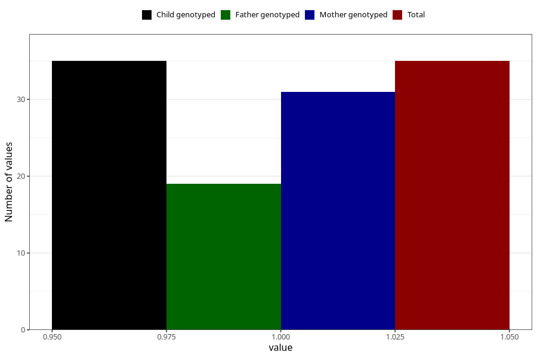

# behavioural_problems_yes_18m
Variable mapping to `EE848` in `Skjema5_18mnd_v12`.
- Number of values:

| Value | Total | Child genotyped | Mother genotyped | Father genotyped |
| ----- | ----- | --------------- | ---------------- | ---------------- |
| Missing | 75273 | 75273 | 71619 | 50065 |
| Non-missing | 35 | 35 | 31 | 19 |
| 1 | 35 | 35 | 31 | 19 |

