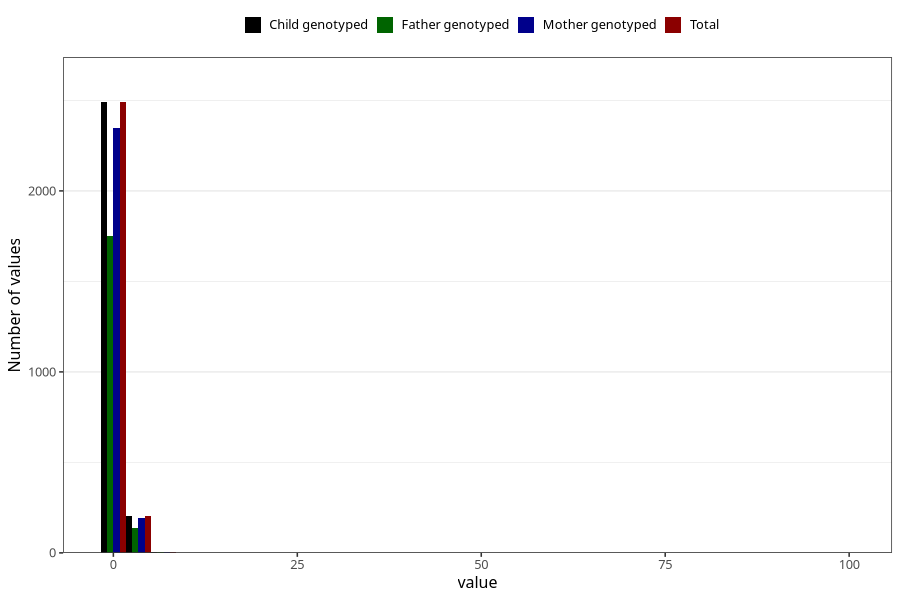

# bronchitis_rs_virus_pneumonia_freq_6m
Variable mapping to `DD280` in `Skjema4_6mnd_v12`.
- Number of values:

| Value | Total | Child genotyped | Mother genotyped | Father genotyped |
| ----- | ----- | --------------- | ---------------- | ---------------- |
| Missing | 72599 | 72599 | 69095 | 48190 |
| Non-missing | 2709 | 2709 | 2555 | 1894 |
| 0 | 82 | 82 | 76 | 60 |
| 1 | 2408 | 2408 | 2272 | 1689 |
| 2 | 157 | 157 | 149 | 105 |
| 3 | 38 | 38 | 35 | 27 |
| 4 | 7 | 7 | 7 | 4 |
| 5 | 4 | 4 | 3 | 2 |
| 6 | 3 | 3 | 3 | 1 |
| 7 | 3 | 3 | 3 | 3 |
| 8 | 1 | 1 | 1 | 0 |
| 9 | 1 | 1 | 1 | 1 |
| 10 | 1 | 1 | 1 | 0 |
| 12 | 1 | 1 | 1 | 0 |
| 14 | 1 | 1 | 1 | 0 |
| 16 | 1 | 1 | 1 | 1 |
| 99 | 1 | 1 | 1 | 1 |

