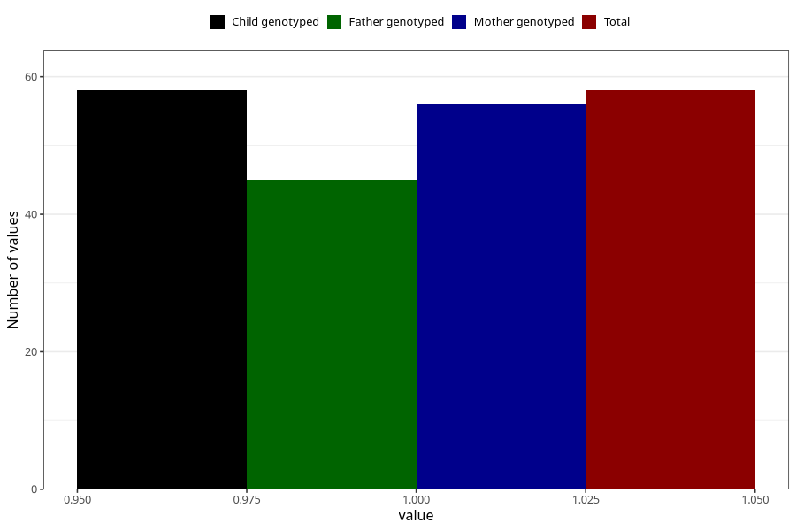

# cerebral_palsy_7y
Variable mapping to `JJ430` in `Skjema7aar_v12`.
- Number of values:

| Value | Total | Child genotyped | Mother genotyped | Father genotyped |
| ----- | ----- | --------------- | ---------------- | ---------------- |
| Missing | 75250 | 75250 | 71594 | 50039 |
| Non-missing | 58 | 58 | 56 | 45 |
| 1 | 58 | 58 | 56 | 45 |

