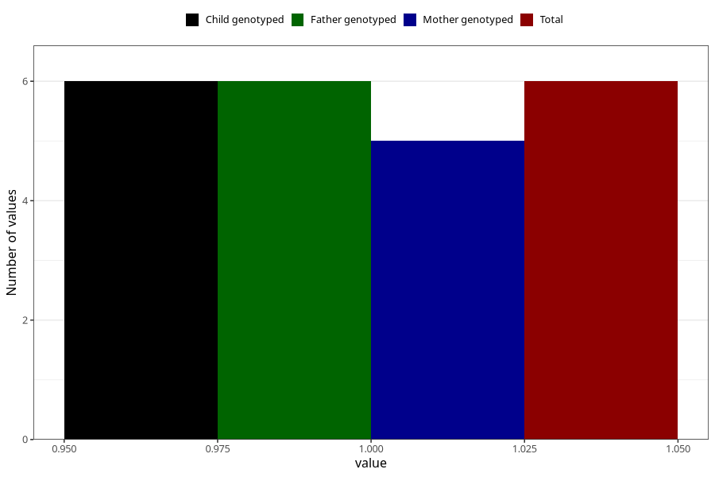

# cerebral_palsy_previous_3y
Variable mapping to `GG43` in `Skjema6_3aar_v12`.
- Number of values:

| Value | Total | Child genotyped | Mother genotyped | Father genotyped |
| ----- | ----- | --------------- | ---------------- | ---------------- |
| Missing | 75302 | 75302 | 71645 | 50078 |
| Non-missing | 6 | 6 | 5 | 6 |
| 1 | 6 | 6 | 5 | 6 |

