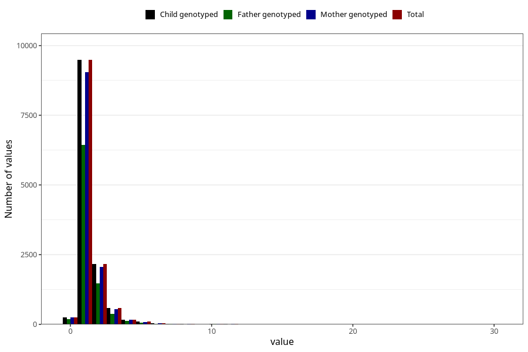

# conjunctivitis_number_6_11m
Variable mapping to `EE251` in `Skjema5_18mnd_v12`.
- Number of values:

| Value | Total | Child genotyped | Mother genotyped | Father genotyped |
| ----- | ----- | --------------- | ---------------- | ---------------- |
| Missing | 62445 | 62445 | 59383 | 41375 |
| Non-missing | 12863 | 12863 | 12267 | 8709 |
| Filled in text or mark instead of number | 2 | 2 | 2 |1 |
| 0 | 256 | 256 | 247 | 179 |
| 1 | 9484 | 9484 | 9038 | 6431 |
| 2 | 2169 | 2169 | 2069 | 1473 |
| 3 | 577 | 577 | 551 | 367 |
| 4 | 172 | 172 | 168 | 122 |
| 5 | 93 | 93 | 88 | 63 |
| 6 | 41 | 41 | 39 | 27 |
| 7 | 15 | 15 | 15 | 12 |
| 8 | 11 | 11 | 10 | 7 |
| 9 | 3 | 3 | 3 | 2 |
| 10 | 22 | 22 | 22 | 14 |
| 11 | 10 | 10 | 8 | 7 |
| 12 | 3 | 3 | 3 | 2 |
| 14 | 1 | 1 | 0 | 1 |
| 15 | 1 | 1 | 1 | 0 |
| 20 | 1 | 1 | 1 | 0 |
| 25 | 1 | 1 | 1 | 0 |
| 30 | 1 | 1 | 1 | 1 |

