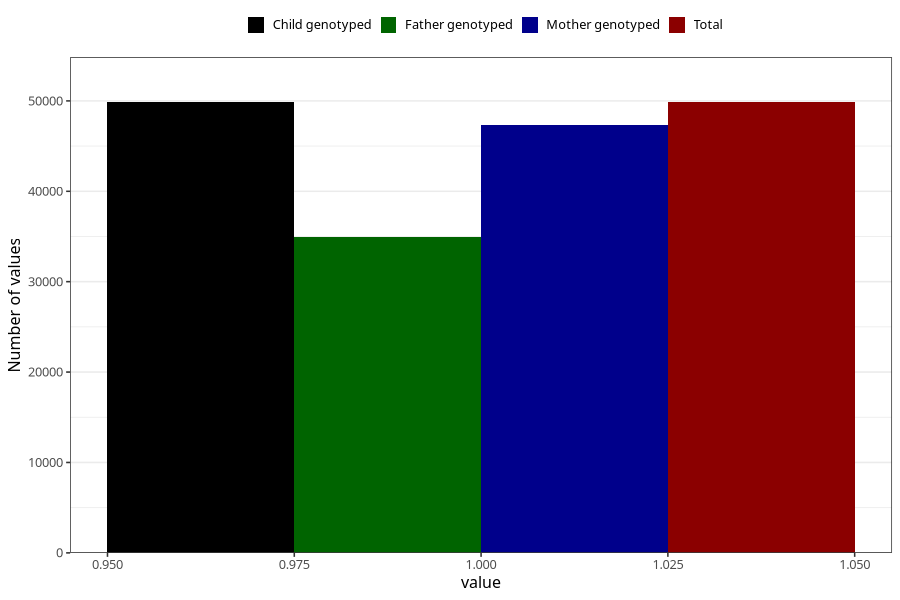

# delayed_speech_development_no_18m
Variable mapping to `EE839` in `Skjema5_18mnd_v12`.
- Number of values:

| Value | Total | Child genotyped | Mother genotyped | Father genotyped |
| ----- | ----- | --------------- | ---------------- | ---------------- |
| Missing | 25454 | 25454 | 24281 | 15159 |
| Non-missing | 49854 | 49854 | 47369 | 34925 |
| 1 | 49854 | 49854 | 47369 | 34925 |

