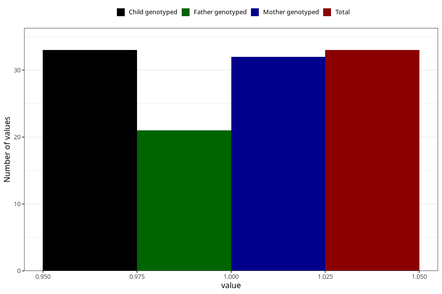

# delayed_speech_development_previously_18m
Variable mapping to `EE841` in `Skjema5_18mnd_v12`.
- Number of values:

| Value | Total | Child genotyped | Mother genotyped | Father genotyped |
| ----- | ----- | --------------- | ---------------- | ---------------- |
| Missing | 75275 | 75275 | 71618 | 50063 |
| Non-missing | 33 | 33 | 32 | 21 |
| 1 | 33 | 33 | 32 | 21 |

