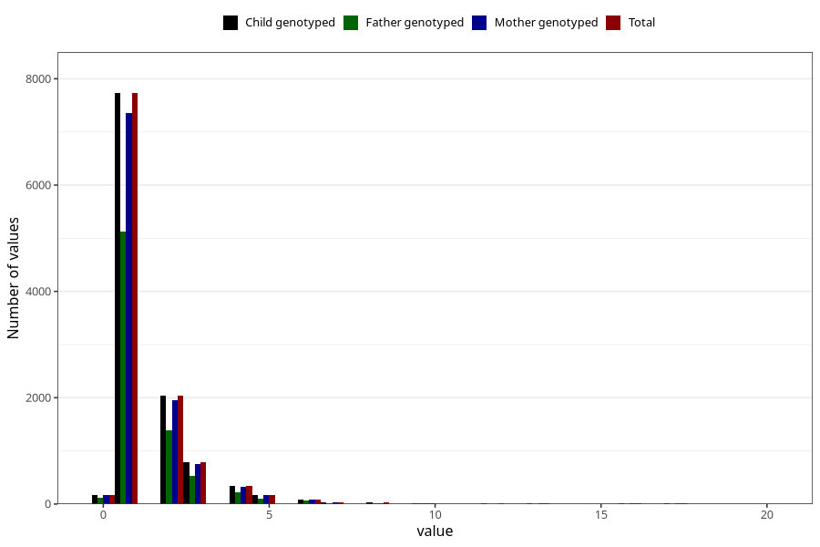

# ear_infection_number_12_18m
Variable mapping to `EE228` in `Skjema5_18mnd_v12`.
- Number of values:

| Value | Total | Child genotyped | Mother genotyped | Father genotyped |
| ----- | ----- | --------------- | ---------------- | ---------------- |
| Missing | 63865 | 63865 | 60720 | 42456 |
| Non-missing | 11443 | 11443 | 10930 | 7628 |
| 25th percentile | 1 | 1 | 1 | 1 |
| 50th percentile | 1 | 1 | 1 | 1 |
| 75th percentile | 2 | 2 | 2 | 2 |
| Mean | 1.58961810713974 | 1.58961810713974 | 1.59176578225069 | 1.58390141583639 |
| Standard deviation | 1.40238661629501 | 1.40238661629501 | 1.40728854880693 | 1.37935588905088 |
| N | 11443 | 11443 | 10930 | 7628 |

