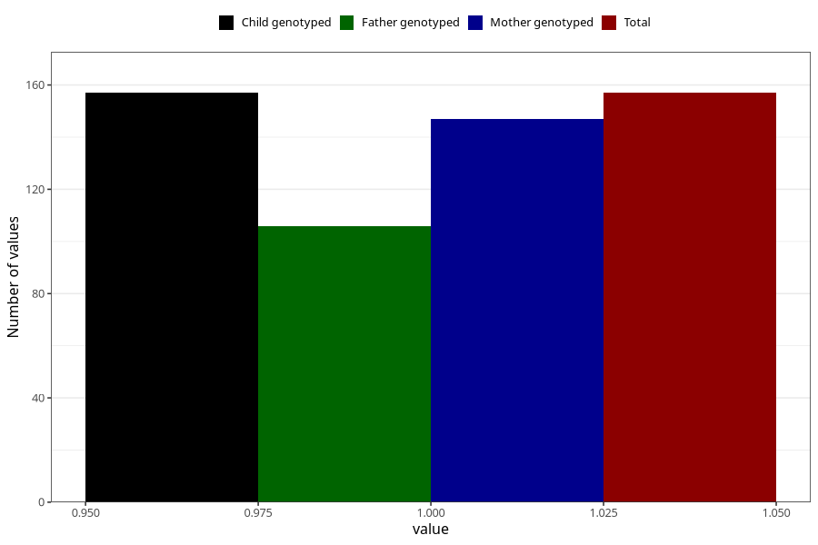

# epilepsy_8y
Variable mapping to `NN29` in `Skjema8aar_v12`.
- Number of values:

| Value | Total | Child genotyped | Mother genotyped | Father genotyped |
| ----- | ----- | --------------- | ---------------- | ---------------- |
| Missing | 75151 | 75151 | 71503 | 49978 |
| Non-missing | 157 | 157 | 147 | 106 |
| 1 | 157 | 157 | 147 | 106 |

