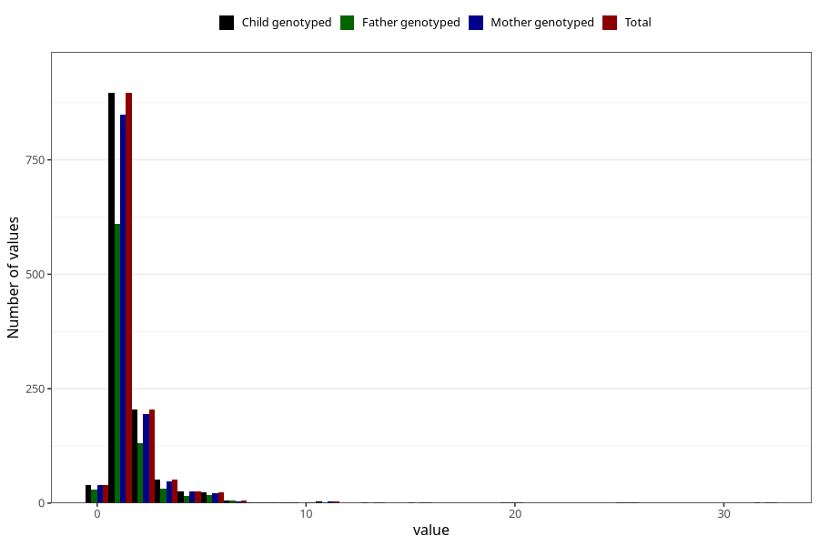

# febrile_convulsions_freq_3y
Variable mapping to `GG159` in `Skjema6_3aar_v12`.
- Number of values:

| Value | Total | Child genotyped | Mother genotyped | Father genotyped |
| ----- | ----- | --------------- | ---------------- | ---------------- |
| Missing | 74050 | 74050 | 70456 | 49237 |
| Non-missing | 1258 | 1258 | 1194 | 847 |
| 0 | 40 | 40 | 40 | 29 |
| 1 | 896 | 896 | 848 | 610 |
| 2 | 205 | 205 | 195 | 131 |
| 3 | 52 | 52 | 48 | 32 |
| 4 | 25 | 25 | 25 | 16 |
| 5 | 16 | 16 | 16 | 13 |
| 6 | 7 | 7 | 6 | 4 |
| 7 | 5 | 5 | 4 | 5 |
| 8 | 2 | 2 | 2 | 2 |
| 9 | 1 | 1 | 1 | 1 |
| 10 | 1 | 1 | 1 | 0 |
| 11 | 3 | 3 | 3 | 2 |
| 13 | 1 | 1 | 1 | 0 |
| 16 | 1 | 1 | 1 | 0 |
| 20 | 1 | 1 | 1 | 1 |
| 25 | 1 | 1 | 1 | 1 |
| 32 | 1 | 1 | 1 | 0 |

