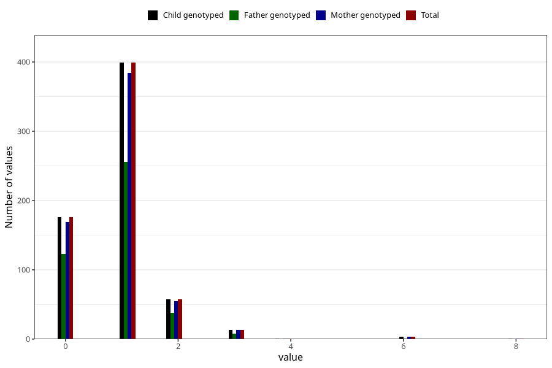

# febrile_convulsions_number_6_11m
Variable mapping to `EE256` in `Skjema5_18mnd_v12`.
- Number of values:

| Value | Total | Child genotyped | Mother genotyped | Father genotyped |
| ----- | ----- | --------------- | ---------------- | ---------------- |
| Missing | 74658 | 74658 | 71024 | 49658 |
| Non-missing | 650 | 650 | 626 | 426 |
| 0 | 176 | 176 | 169 | 123 |
| 1 | 399 | 399 | 384 | 256 |
| 2 | 57 | 57 | 55 | 38 |
| 3 | 13 | 13 | 13 | 8 |
| 4 | 1 | 1 | 1 | 0 |
| 6 | 3 | 3 | 3 | 1 |
| 8 | 1 | 1 | 1 | 0 |

