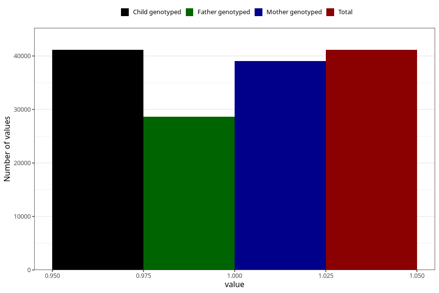

# gained_too_much_weight_no_3y
Variable mapping to `GG57` in `Skjema6_3aar_v12`.
- Number of values:

| Value | Total | Child genotyped | Mother genotyped | Father genotyped |
| ----- | ----- | --------------- | ---------------- | ---------------- |
| Missing | 34177 | 34177 | 32571 | 21415 |
| Non-missing | 41131 | 41131 | 39079 | 28669 |
| 1 | 41131 | 41131 | 39079 | 28669 |

